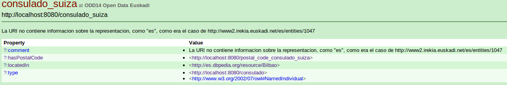

Mejora de Linked Data en Open Data Euskadi (ODD14)
==================================================

Motivación
----------

Este repositorio contiene el resultado del trabajo realizado en [Open Data Hack Day Bilbao 2014](http://dev.morelab.deusto.es/hackathon/index.php/P%C3%A1gina_principal) por el grupo de trabajo [Tutorial de Linked Data con ejemplo real de Open Data Euskadi](http://dev.morelab.deusto.es/hackathon/index.php/Tutorial_de_Linked_Data_con_ejemplo_real_de_Open_Data_Euskadi). El resultado es un "pack" (Triple store, servidor web, pubby) que puede ser desplegado en cualquier máquina GNU/Linux y una vez funcionando demuestra la estructura y funcionamiento completo de un servidor [Linked Data](http://es.wikipedia.org/wiki/Linked_Data), en este caso con unos datos concretos de Open Data Euskadi.

La motivación para desarrollar este pack era dar una demostración completa y autocontenida de cómo solucionar los problemas descritos en detalle en [Crítica a Linked Data en Open Data Euskadi](http://mikeleganaaranguren.wordpress.com/2013/10/22/critica-a-linked-data-en-open-data-euskadi/), que básicamente son:

* Las URIs de las entidades no se refieren a sí mismas, si no a páginas que las contienen: En Linked Data, las URIs identifican entidades, no sus representaciones en HTML o RDF.
* No hay negociacion de contenido: En Linked Data, el agente que pide una entidad por su URI especifica si prefiere RDF (si es un programa) o HTML (si es un navegador cuyo usuario es un humano), precisamente por que la URI identifica a una entidad, no sus representaciones. A su vez, que esto sea asi permite que enlacemos entidades, no sus representaciones. 
* Carencia de enlaces a datasets externos.

Este pack soluciona cada uno de los puntos, con un dataset en RDF construido a mano y toda la infraestructura necesaria, ya configurada, que implementa la negociación de contenido. También sirve como tutorial para aprender, "con las manos en la masa", cómo publicar datasets en Linked Data.

Requerimientos
--------------

* Conocimientos básicos de UNIX, [RDF](http://www.w3.org/standards/techs/rdf), [OWL](http://www.w3.org/standards/techs/owl) y [SPARQL](http://www.w3.org/standards/techs/sparql).
* GNU/Linux (probado en Ubuntu, es probable que funcione sin problemas en cualquier distribución).
* Ruby (Probado con 1.8.7).
* Java (Probado con JRE HotSpot 1.7).
* Puertos 3030 y 8080 abiertos.
* CURL para comprobar negociación de contenido.

Detalles técnicos
-----------------

El pack incluye:

* Un dataset que describe información sobre el consulado de Suiza (`suiza.owl`), con enlaces a otros datasets de la nube [Linked Open Data](http://lod-cloud.net/) y que usa vocabularios estándar para representar la información: 
  * vCard, como en el original de Open Data Euskadi: http://www.w3.org/TR/vcard-rdf/
  * GeoNames: http://www.geonames.org/ontology/ontology_v3.1.rdf

* Triple store para almacenar el dataset y proveer un SPARQL endpoint, en este caso [Jena-Fuseki](http://jena.apache.org/documentation/serving_data/index.html).
* [Pubby](http://wifo5-03.informatik.uni-mannheim.de/pubby/), que implementa todo lo necesario para que Linked Data funcione, como aplicación dentro del servidor web [Jetty](http://jetty.codehaus.org/jetty/), configurado para usar Fuseki como SPARQL endpoint.

Instrucciones para terminal
---------------------------

Para que la demostración funcione hay que poner en funcionamiento Fuseki, cargar suiza.owl en el mismo, y poner a funcionar Pubby. Ir a `/jena-fuseki-0.2.6-SNAPSHOT` y hacer Fuseki ejecutable:

`chmod +x fuseki-server s-*`

Crear directorio odd14db:

`mkdir odd14db`

Iniciar servidor fuseki:

`./fuseki-server --update --loc=./odd14db /dataset`

En otra terminal, subir el dataset a Fuseki: 

`./s-put http://localhost:3030/dataset/data odd14 ../suiza.owl`

Pubby y Jetty ya estan configurados (fijarse en `jetty-distribution-9.0.0.M3/webapps/ROOT/WEB-INF/odd14-config-file.ttl` y `jetty-distribution-9.0.0.M3/webapps/ROOT/WEB-INF/web.xml`), solo hace falta ejecutar Jetty, que ya contiene Pubby como aplicacion web. Ir a `jetty-distribution-9.0.0.M3/` y ejecutar para que escuche en el puerto 8080:

`java -jar start.jar jetty.port=8080`

## Resultado

Si abrimos en un navegador [http://localhost:8080/consulado_suiza], Pubby nos redirecciona a [http://localhost:8080/page/consulado_suiza] y aparecerá una página web (bastante fea :P) con el dataset. Hay enlaces internos (hasPostalCode, type) y externos (located_in). Es importante darse cuenta de que el enlace externo a través de located_in apunta a la URI que identifica a la entidad Bilbao en la DBPedia (http://es.dbpedia.org/resource/Bilbao), no a su representacion en HTML (http://es.dbpedia.org/page/Bilbao), a la que nos llevará el Pubby de DBpedia.  

Podemos comprobar la negociacion de contenido en una terminal  con CURL (http://richard.cyganiak.de/blog/2007/02/debugging-semantic-web-sites-with-curl/). Para empezar simulamos ser una navegador web, es decir necesitamos HTML para consumo humano: 

`curl http://localhost:8080/consulado_suiza`

Nos devuelve: 

`303 See Other: For a description of this item, see http://localhost:8080/page/consulado_suiza`

El código HTTP 303 nos redirecciona a http://localhost:8080/page/consulado_suiza:

`curl http://localhost:8080/page/consulado_suiza` 

Nos devuelve la página HTML. 

Podemos simular ser una agente automático (por ejemplo un programa que va recolectando información sobre consulados de Euskadi) que necesita RDF:

`curl -H "Accept: application/rdf+xml" http://localhost:8080/consulado_suiza`

Nos devuelve: 

`303 See Other: For a description of this item, see http://localhost:8080/data/consulado_suiza`

El código HTTP 303 nos redirecciona a http://localhost:8080/data/consulado_suiza:

`curl http://localhost:8080/data/consulado_suiza` 

Nos devuelve los datos en RDF. 

Conclusiones y advertencias
---------------------------

En este proceso hemos completado todo el ciclo de publicación Linked Data: partimos de un dataset que subimos a un servidor y el servidor provee a los usuarios el interfaz HTML o los datos en RDF. Mediante este proceso podemos apreciar algunas de las ventajas de Linked Data:

* Podemos crear enlaces a datos externos (ej. located_in) y asi integrar información a través de la infraestructura web ya existente. Este proceso es mucho más sencillo y eficiente que, por ejemplo, integrar la base de datos de consulados de Euskadi con la base de datos de la wikipedia a mano. También pueden enlazar a nuestro dataset, usando la URI [http://localhost:8080/consulado_suiza]; repito, no confundir con [http://localhost:8080/page/consulado_suiza]! 

* Como este dataset usa vocabularios (ontologías) ya conocidos como vCard, el agente automático podra procesar la informacion con facilidad, ya que ya sabe de antemano el significado de, por ejemplo, has_postal_code. Es decir, la semántica de la información es computacionalmente explícita, representada en un lenguaje estándar (OWL), de modo que la lógica interna del programa se aligera, desplazándose a la ontología (en este caso vCard).

Hay que tener en cuenta que todo esto está "construido con palillos", no he tenido en cuenta ni la eficiencia ni la seguridad, ya que el objetivo era tenerlo funcionando (De hecho, el archivo de configuración de Pubby deja mucho que desear). Para implementar esto en producción habría que cambiar el archivo de configuración de Pubby en muchos puntos, siendo los más importantes el SPARQL endpoint y el mapeo de URIs externas a URIs del dataset (de [http://localhost:8080/consulado_suiza] que pide el agente a [http://www.irekia.euskadi.net/entities#consulado_suiza] que esta en el dataset), usar un triple store como Virtuoso o Stardog, un servidor web como Tomcat, etc. En producción también habría que toner en cuenta que hay diferentes opciones para la negociación de contenido (http://linkeddatabook.com/editions/1.0/#htoc11).

Agradecimientos
---------------

Desgraciadamente no tengo los nombres de todo nuestro equipo. Si estabas en él y tu nombre no aparece aquí, hazmelo saber o mejor todavía, haz un fork y un pull request:

* Gorka Arkotxa 
* Jon Alfaro
* ???
* Urtza Iturraspe
* ???
* Iñaki Arrieta
* Iñigo Robredo

